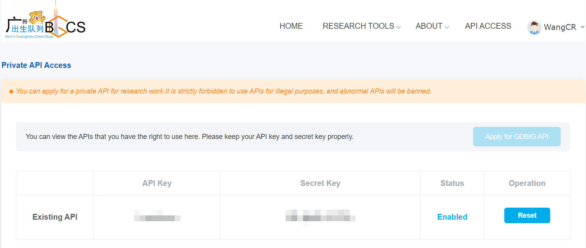

GDBIGtools: A command line tools for GDBIG varaints browser
===========================================================

[](https://pypi.org/project/GDBIGtools/)
[](https://github.com/BIGCS-Lab/GDBIGtools/blob/master/LICENSE)

Introduction
------------
The [Genome Database of Born In Guangzhou Cohort study(GDBIG)](http://gdbig.bigcs.com.cn) is based on thousands of trios/duos families recruited by the BIGCS Project to conduct whole-genome-sequencing, genome variation detection, annotation and analysis. Phase I including 332 trios (father-mother-offspring), 1,406 duos (14 father-offspring and 1,392 mother-offspring) and 245 single individuals (70 infants, 150 adult females and 25 adult males), for a total of 4,053 individual samples. The GDBIG delivers periodical and useful variation information and scientific insights derived from the analysis of thousands of born in Guangzhou China sequencing data. The results aim to promote genetic research and precision medicine actions in China. The delivering information includes any of detected variants and the corresponding allele frequency, annotation, frequency comparison to the global populations from existing databases, etc.

GDBIG variant browser allows authorized access its data through an Genomics API and **GDBIGtools** is a convenient command line tools for the [GDBIG](http://gdbig.bigcs.com.cn) variants browser.

No only GDBIG database but also other external databases\' Allele Frequency you could abtain.
Up to now, the following databases are integrated:

- [GDBIG](http://gdbig.bigcs.com.cn)
- [CMDB](https://linkinghub.elsevier.com/retrieve/pii/S0092867418310328)
- [ChinaMAP](http://www.mbiobank.com/)
- [NyuWa (NCVD)](http://bigdata.ibp.ac.cn/NyuWa_variants/)
- [WBBC](https://wbbc.westlake.edu.cn/)
- [gnomAD](https://gnomad.broadinstitute.org)
- [1000 genomes project](https://www.internationalgenome.org/)

<br />

Preparation
------------

#### Installation
Install the released version by `pip` (Only support Python3.6+):

```bash
pip install GDBIGtools
# or upgrade
pip install --upgrade GDBIGtools
```

#### Help

type `GDBIGtools -h/--help` for detail.
```
Usage: GDBIGtools [OPTIONS] COMMAND [ARGS]...

Options:
  -h, --help  Show this message and exit.

Commands:
  annotate   Annotate input VCF file with BIGCS allele Frequency.
  login      Login GDBIG.
  logout     Logout GDBIG.
  print-api  Display API information for GDBIG.
  query      Query variants from GDBIG database.
  version    GDBIGtools version: 1.1.4
```

#### Login

Login with `GDBIGtools` by using GDBIG API access key, which could be found from [**<API ACCESS\>**](http://gdbig.bigcs.com.cn/api.html) if you have apply for it.

[](assets/figures/GDBIG_genomics_api.png)

\*Reset your GDBIG API access key if it had been leaked out.

And then you can login in command:

```bash
GDBIGtools login -k <API Key> -s <Secret Key>
```

If everything goes smoothly, means you can use GDBIG as one of your varaints database in command line mode.

#### Logout

Logout `GDBIGtools` by simply run the command below:

```bash
GDBIGtools logout
```
<br />

Quick start
------------
**\*Note**: Please enable your API access in [**GDBIG API**](http://gdbig.bigcs.com.cn/api.html) before using **GDBIGtools**.

#### Query a single variant

Variants could be retrieved from GDBIG by using `query`.

Run `GDBIGtools query -h/--help` to see all available options. There\'re
two different ways to retrive variants.

One is to use `-s` parameters for variants on command, the other way uses `-l` for input-file.

Here are examples for quering varaints on command.

```bash
GDBIGtools query -s rs117518546
GDBIGtools query -s 21:9662064
GDBIGtools query -s 22:10577666-10581518
GDBIGtools query -s ENST00000269305
GDBIGtools query -s MTHFR
```

It\'ll take about 1 minute to complete about 2,000 variants\' sites. 
Then you will get 32 new fields with the information of GDBIG in VCF INFO column:

-   `AF_GDBIG`: Alternate Allele Frequencies in GDBIG;
-   `AF_GDBIG_SouthChina`: Alternate Allele Frequencies from SouthChina region in GDBIG;
-   `AF_GDBIG_CentralChina`: Alternate Allele Frequencies from CentralChina region in GDBIG;
-   `AF_GDBIG_EastChina`: Alternate Allele Frequencies from EastChina region in GDBIG.
-   `AF_GDBIG_SouthwestChina`: Alternate Allele Frequencies from SouthwestChina region in GDBIG;
-   `AF_GDBIG_NortheastChina`: Alternate Allele Frequencies from NortheastChina region in GDBIG;
-   `AF_GDBIG_NorthwestChina`: Alternate Allele Frequencies from NorthwestChina region in GDBIG;
-   `AF_GDBIG_NorthChina`: Alternate Allele Frequencies from NorthChina region in GDBIG;
-   `AF_CMDB`: Alternate Allele Frequencies in CMDB database;
-   `AF_ChinaMAP`: Alternate Allele Frequencies in ChinaMAP database;
-   `AF_NyuWa`: Alternate Allele Frequencies in NyuWa(NCVD) database;
-   `AF_WBBC`: Alternate Allele Frequencies in WBBC database;
-   `AF_WBBC_North`: Alternate Allele Frequencies from North region in WBBC database;
-   `AF_WBBC_Central`: Alternate Allele Frequencies from Central region in WBBC database;
-   `AF_WBBC_South`: Alternate Allele Frequencies from South region in WBBC database;
-   `AF_WBBC_Lingnan`: Alternate Allele Frequencies from Lingnan region in WBBC database;
-   `AF_gnomAD`: Alternate Allele Frequencies in gnomAD database;
-   `AF_gnomAD_afr`: Alternate Allele Frequencies from African-American/African population in gnomAD database;
-   `AF_gnomAD_ami`: Alternate Allele Frequencies from Amish population in gnomAD database;
-   `AF_gnomAD_asj`: Alternate Allele Frequencies from Ashkenazi Jewish population in gnomAD database;
-   `AF_gnomAD_eas`: Alternate Allele Frequencies from East Asian population in gnomAD database;
-   `AF_gnomAD_fin`: Alternate Allele Frequencies from Finnish population in gnomAD database;
-   `AF_gnomAD_amr`: Alternate Allele Frequencies from Latino population in gnomAD database;
-   `AF_gnomAD_nfe`: Alternate Allele Frequencies from Non-Finnish European population in gnomAD database;
-   `AF_gnomAD_sas`: Alternate Allele Frequencies from South Asian population in gnomAD database;
-   `AF_gnomAD_oth`: Alternate Allele Frequencies from Other population in gnomAD database;
-   `AF_1KGP`: Alternate Allele Frequencies in 1000 Genomes database;
-   `AF_1KGP_AFR`: Alternate Allele Frequencies from African population in 1000 Genomes database;
-   `AF_1KGP_AMR`: Alternate Allele Frequencies from Admixed American population in 1000 Genomes database;
-   `AF_1KGP_EAS`: Alternate Allele Frequencies from East Asian population in 1000 Genomes database;
-   `AF_1KGP_EUR`: Alternate Allele Frequencies from European population in 1000 Genomes database;
-   `AF_1KGP_SAS`: Alternate Allele Frequencies from South Asian population in 1000 Genomes database;

And you will get query result looks like below:

```bash
##fileformat=VCFv4.2
##FILTER=<ID=PASS,Description="All filters passed">
##INFO=<ID=AF_GDBIG,Number=A,Type=Float,Description="Alternate Allele Frequencies in GDBIG_GRCh38_v1.0">
##INFO=<ID=AF_GDBIG_SouthChina,Number=A,Type=Float,Description="Alternate Allele Frequencies from SouthChina region in GDBIG_GRCh38_v1.0">
##INFO=<ID=AF_GDBIG_CentralChina,Number=A,Type=Float,Description="Alternate Allele Frequencies from CentralChina region in GDBIG_GRCh38_v1.0">
##INFO=<ID=AF_GDBIG_EastChina,Number=A,Type=Float,Description="Alternate Allele Frequencies from EastChina region in GDBIG_GRCh38_v1.0">
##INFO=<ID=AF_GDBIG_SouthwestChina,Number=A,Type=Float,Description="Alternate Allele Frequencies from SouthwestChina region in GDBIG_GRCh38_v1.0">
##INFO=<ID=AF_GDBIG_NortheastChina,Number=A,Type=Float,Description="Alternate Allele Frequencies from NortheastChina region in GDBIG_GRCh38_v1.0">
##INFO=<ID=AF_GDBIG_NorthwestChina,Number=A,Type=Float,Description="Alternate Allele Frequencies from NorthwestChina region in GDBIG_GRCh38_v1.0">
##INFO=<ID=AF_GDBIG_NorthChina,Number=A,Type=Float,Description="Alternate Allele Frequencies from NorthChina region in GDBIG_GRCh38_v1.0">
##INFO=<ID=AF_CMDB,Number=A,Type=Float,Description="Alternate Allele Frequencies in CMDB database">
##INFO=<ID=AF_ChinaMAP,Number=A,Type=Float,Description="Alternate Allele Frequencies in ChinaMAP database">
##INFO=<ID=AF_NyuWa,Number=A,Type=Float,Description="Alternate Allele Frequencies in NyuWa(NCVD) database">
##INFO=<ID=AF_WBBC,Number=A,Type=Float,Description="Alternate Allele Frequencies in WBBC database">
##INFO=<ID=AF_WBBC_North,Number=A,Type=Float,Description="Alternate Allele Frequencies from North region in WBBC database">
##INFO=<ID=AF_WBBC_Central,Number=A,Type=Float,Description="Alternate Allele Frequencies from Central region in WBBC database">
##INFO=<ID=AF_WBBC_South,Number=A,Type=Float,Description="Alternate Allele Frequencies from South region in WBBC database">
##INFO=<ID=AF_WBBC_Lingnan,Number=A,Type=Float,Description="Alternate Allele Frequencies from Lingnan region in WBBC database">
##INFO=<ID=AF_gnomAD,Number=A,Type=Float,Description="Alternate Allele Frequencies in gnomAD database">
##INFO=<ID=AF_gnomAD_afr,Number=A,Type=Float,Description="Alternate Allele Frequencies from African-American/African population in gnomAD database">
##INFO=<ID=AF_gnomAD_ami,Number=A,Type=Float,Description="Alternate Allele Frequencies from Amish population in gnomAD database">
##INFO=<ID=AF_gnomAD_asj,Number=A,Type=Float,Description="Alternate Allele Frequencies from Ashkenazi Jewish population in gnomAD database">
##INFO=<ID=AF_gnomAD_eas,Number=A,Type=Float,Description="Alternate Allele Frequencies from East Asian population in gnomAD database">
##INFO=<ID=AF_gnomAD_fin,Number=A,Type=Float,Description="Alternate Allele Frequencies from Finnish population in gnomAD database">
##INFO=<ID=AF_gnomAD_amr,Number=A,Type=Float,Description="Alternate Allele Frequencies from Latino population in gnomAD database">
##INFO=<ID=AF_gnomAD_nfe,Number=A,Type=Float,Description="Alternate Allele Frequencies from Non-Finnish European population in gnomAD database">
##INFO=<ID=AF_gnomAD_sas,Number=A,Type=Float,Description="Alternate Allele Frequencies from South Asian population in gnomAD database">
##INFO=<ID=AF_gnomAD_oth,Number=A,Type=Float,Description="Alternate Allele Frequencies from Other population in gnomAD database">
##INFO=<ID=AF_1KGP,Number=A,Type=Float,Description="Alternate Allele Frequencies in 1000 Genomes database">
##INFO=<ID=AF_1KGP_AFR,Number=A,Type=Float,Description="Alternate Allele Frequencies from African population in 1000 Genomes database">
##INFO=<ID=AF_1KGP_AMR,Number=A,Type=Float,Description="Alternate Allele Frequencies from Admixed American population in 1000 Genomes database">
##INFO=<ID=AF_1KGP_EAS,Number=A,Type=Float,Description="Alternate Allele Frequencies in from East Asian population 1000 Genomes database">
##INFO=<ID=AF_1KGP_EUR,Number=A,Type=Float,Description="Alternate Allele Frequencies in from European population 1000 Genomes database">
##INFO=<ID=AF_1KGP_SAS,Number=A,Type=Float,Description="Alternate Allele Frequencies in from South Asian population 1000 Genomes database">
##reference=file:/human_reference/GRCh38/GCA_000001405.15_GRCh38_no_alt_analysis_set.fa
#CHROM  POS ID  REF ALT QUAL  FILTER  INFO
chr22 10577666  rs1491296197  CAT C . PASS  AF_GDBIG=0.000123;AF_GDBIG_SouthChina=0.000169;AF_GDBIG_CentralChina=0;AF_GDBIG_EastChina=0;AF_GDBIG_SouthwestChina=0;AF_GDBIG_NortheastChina=0;AF_GDBIG_NorthwestChina=0;AF_GDBIG_NorthChina=0;AF_CMDB=NA;AF_ChinaMAP=0.000605;AF_NyuWa=NA;AF_WBBC=0.00033415;AF_WBBC_North=0.00037092;AF_WBBC_Central=0;AF_WBBC_South=0.00037092;AF_WBBC_Lingnan=0;AF_gnomAD=0.000224749;AF_gnomAD_afr=9.27558e-05;AF_gnomAD_ami=0;AF_gnomAD_asj=0;AF_gnomAD_eas=0.00037679;AF_gnomAD_fin=0;AF_gnomAD_amr=0.000986193;AF_gnomAD_nfe=0.000206587;AF_gnomAD_sas=0;AF_gnomAD_oth=0;AF_1KGP=NA;AF_1KGP_AFR=NA;AF_1KGP_AMR=NA;AF_1KGP_EAS=NA;AF_1KGP_EUR=NA;AF_1KGP_SAS=NA
chr22 10577851  . TA  T . PASS  AF_GDBIG=0.000123;AF_GDBIG_SouthChina=0.000169;AF_GDBIG_CentralChina=0;AF_GDBIG_EastChina=0;AF_GDBIG_SouthwestChina=0;AF_GDBIG_NortheastChina=0;AF_GDBIG_NorthwestChina=0;AF_GDBIG_NorthChina=0;AF_CMDB=NA;AF_ChinaMAP=NA;AF_NyuWa=NA;AF_WBBC=NA;AF_WBBC_North=NA;AF_WBBC_Central=NA;AF_WBBC_South=NA;AF_WBBC_Lingnan=NA;AF_gnomAD=NA;AF_gnomAD_afr=NA;AF_gnomAD_ami=NA;AF_gnomAD_asj=NA;AF_gnomAD_eas=NA;AF_gnomAD_fin=NA;AF_gnomAD_amr=NA;AF_gnomAD_nfe=NA;AF_gnomAD_sas=NA;AF_gnomAD_oth=NA;AF_1KGP=NA;AF_1KGP_AFR=NA;AF_1KGP_AMR=NA;AF_1KGP_EAS=NA;AF_1KGP_EUR=NA;AF_1KGP_SAS=NA
chr22 10580900  . ATTC  A . PASS  AF_GDBIG=0.000369;AF_GDBIG_SouthChina=0.000506;AF_GDBIG_CentralChina=0;AF_GDBIG_EastChina=0;AF_GDBIG_SouthwestChina=0;AF_GDBIG_NortheastChina=0;AF_GDBIG_NorthwestChina=0;AF_GDBIG_NorthChina=0;AF_CMDB=NA;AF_ChinaMAP=NA;AF_NyuWa=NA;AF_WBBC=NA;AF_WBBC_North=NA;AF_WBBC_Central=NA;AF_WBBC_South=NA;AF_WBBC_Lingnan=NA;AF_gnomAD=NA;AF_gnomAD_afr=NA;AF_gnomAD_ami=NA;AF_gnomAD_asj=NA;AF_gnomAD_eas=NA;AF_gnomAD_fin=NA;AF_gnomAD_amr=NA;AF_gnomAD_nfe=NA;AF_gnomAD_sas=NA;AF_gnomAD_oth=NA;AF_1KGP=NA;AF_1KGP_AFR=NA;AF_1KGP_AMR=NA;AF_1KGP_EAS=NA;AF_1KGP_EUR=NA;AF_1KGP_SAS=NA
chr22 10581005  rs1268262722  C T . PASS  AF_GDBIG=0.000123;AF_GDBIG_SouthChina=0;AF_GDBIG_CentralChina=0;AF_GDBIG_EastChina=0;AF_GDBIG_SouthwestChina=0.003571;AF_GDBIG_NortheastChina=0;AF_GDBIG_NorthwestChina=0;AF_GDBIG_NorthChina=0;AF_CMDB=NA;AF_ChinaMAP=9.9e-05;AF_NyuWa=NA;AF_WBBC=NA;AF_WBBC_North=NA;AF_WBBC_Central=NA;AF_WBBC_South=NA;AF_WBBC_Lingnan=NA;AF_gnomAD=2.39067e-05;AF_gnomAD_afr=0;AF_gnomAD_ami=0;AF_gnomAD_asj=0;AF_gnomAD_eas=0;AF_gnomAD_fin=0;AF_gnomAD_amr=0;AF_gnomAD_nfe=5.56091e-05;AF_gnomAD_sas=0;AF_gnomAD_oth=0;AF_1KGP=NA;AF_1KGP_AFR=NA;AF_1KGP_AMR=NA;AF_1KGP_EAS=NA;AF_1KGP_EUR=NA;AF_1KGP_SAS=NA
```

#### Quering for input-file

A list of variants could be retrieved from GDBIG by using the parameters of `-l` when apply by `query`.

```bash
GDBIGtools query -l positions.list > result.vcf
```

Format for [positions.list](tests/positions.list), could be a mixture of
- `rs ID`
- `ensembl transcript ID`
- `gene symbol` and `ensembl gene ID`
- `chrom   position` and `chrom    start   end`, even with or without `chr` in the chromosome ID column

```
#search key words
rs117518546
chr1:11795125
ENST00000269305
MTHFR

#CHROM	POS	[POS_END]
chr22	17662883
22	17669209    17669357
```

Actrually you can use `-s` and `-l` simultaneously if you want.

```bash
GDBIGtools query -s 22:46616520 -l positions.list > result.vcf
```

#### Annotate your VCF files

Annotate your VCF file with GDBIG by using `GDBIGtools annotate` command.

Download a list of example variants in VCF format from [GDBIG.test.vcf](tests/GDBIG.test.vcf). 
To annotate this list of variants with allele frequences from GDBIG, you can just run the following command in Linux or Mac OS.

```bash
GDBIGtools annotate -i GDBIG.test.vcf | bgzip > output.GDBIG.test.vcf.gz
```

`output.GDBIG.test.vcf.gz` is VCF format and looks like below:

```bash
##fileformat=VCFv4.2
##FILTER=<ID=PASS,Description="All filters passed">
##FORMAT=<ID=DS,Number=1,Type=Float,Description="estimated ALT dose [P(RA) + P(AA)]">
##FORMAT=<ID=GP,Number=G,Type=Float,Description="Estimated Genotype Probability">
##FORMAT=<ID=GT,Number=1,Type=String,Description="Genotype">
##bcftools_concatVersion=1.9+htslib-1.9
##reference=file:/GRCh38/GCA_000001405.15_GRCh38_no_alt_analysis_set.fa
##INFO=<ID=AF_GDBIG,Number=A,Type=Float,Description="Alternate Allele Frequencies in GDBIG_GRCh38_v1.0">
##INFO=<ID=AF_GDBIG_SouthChina,Number=A,Type=Float,Description="Alternate Allele Frequencies from SouthChina region in GDBIG_GRCh38_v1.0">
##INFO=<ID=AF_GDBIG_CentralChina,Number=A,Type=Float,Description="Alternate Allele Frequencies from CentralChina region in GDBIG_GRCh38_v1.0">
##INFO=<ID=AF_GDBIG_EastChina,Number=A,Type=Float,Description="Alternate Allele Frequencies from EastChina region in GDBIG_GRCh38_v1.0">
##INFO=<ID=AF_GDBIG_SouthwestChina,Number=A,Type=Float,Description="Alternate Allele Frequencies from SouthwestChina region in GDBIG_GRCh38_v1.0">
##INFO=<ID=AF_GDBIG_NortheastChina,Number=A,Type=Float,Description="Alternate Allele Frequencies from NortheastChina region in GDBIG_GRCh38_v1.0">
##INFO=<ID=AF_GDBIG_NorthwestChina,Number=A,Type=Float,Description="Alternate Allele Frequencies from NorthwestChina region in GDBIG_GRCh38_v1.0">
##INFO=<ID=AF_GDBIG_NorthChina,Number=A,Type=Float,Description="Alternate Allele Frequencies from NorthChina region in GDBIG_GRCh38_v1.0">
##INFO=<ID=AF_CMDB,Number=A,Type=Float,Description="Alternate Allele Frequencies in CMDB database">
##INFO=<ID=AF_ChinaMAP,Number=A,Type=Float,Description="Alternate Allele Frequencies in ChinaMAP database">
##INFO=<ID=AF_NyuWa,Number=A,Type=Float,Description="Alternate Allele Frequencies in NyuWa(NCVD) database">
##INFO=<ID=AF_WBBC,Number=A,Type=Float,Description="Alternate Allele Frequencies in WBBC database">
##INFO=<ID=AF_WBBC_North,Number=A,Type=Float,Description="Alternate Allele Frequencies from North region in WBBC database">
##INFO=<ID=AF_WBBC_Central,Number=A,Type=Float,Description="Alternate Allele Frequencies from Central region in WBBC database">
##INFO=<ID=AF_WBBC_South,Number=A,Type=Float,Description="Alternate Allele Frequencies from South region in WBBC database">
##INFO=<ID=AF_WBBC_Lingnan,Number=A,Type=Float,Description="Alternate Allele Frequencies from Lingnan region in WBBC database">
##INFO=<ID=AF_gnomAD,Number=A,Type=Float,Description="Alternate Allele Frequencies in gnomAD database">
##INFO=<ID=AF_gnomAD_afr,Number=A,Type=Float,Description="Alternate Allele Frequencies from African-American/African population in gnomAD database">
##INFO=<ID=AF_gnomAD_ami,Number=A,Type=Float,Description="Alternate Allele Frequencies from Amish population in gnomAD database">
##INFO=<ID=AF_gnomAD_asj,Number=A,Type=Float,Description="Alternate Allele Frequencies from Ashkenazi Jewish population in gnomAD database">
##INFO=<ID=AF_gnomAD_eas,Number=A,Type=Float,Description="Alternate Allele Frequencies from East Asian population in gnomAD database">
##INFO=<ID=AF_gnomAD_fin,Number=A,Type=Float,Description="Alternate Allele Frequencies from Finnish population in gnomAD database">
##INFO=<ID=AF_gnomAD_amr,Number=A,Type=Float,Description="Alternate Allele Frequencies from Latino population in gnomAD database">
##INFO=<ID=AF_gnomAD_nfe,Number=A,Type=Float,Description="Alternate Allele Frequencies from Non-Finnish European population in gnomAD database">
##INFO=<ID=AF_gnomAD_sas,Number=A,Type=Float,Description="Alternate Allele Frequencies from South Asian population in gnomAD database">
##INFO=<ID=AF_gnomAD_oth,Number=A,Type=Float,Description="Alternate Allele Frequencies from Other population in gnomAD database">
##INFO=<ID=AF_1KGP,Number=A,Type=Float,Description="Alternate Allele Frequencies in 1000 Genomes database">
##INFO=<ID=AF_1KGP_AFR,Number=A,Type=Float,Description="Alternate Allele Frequencies from African population in 1000 Genomes database">
##INFO=<ID=AF_1KGP_AMR,Number=A,Type=Float,Description="Alternate Allele Frequencies from Admixed American population in 1000 Genomes database">
##INFO=<ID=AF_1KGP_EAS,Number=A,Type=Float,Description="Alternate Allele Frequencies in from East Asian population 1000 Genomes database">
##INFO=<ID=AF_1KGP_EUR,Number=A,Type=Float,Description="Alternate Allele Frequencies in from European population 1000 Genomes database">
##INFO=<ID=AF_1KGP_SAS,Number=A,Type=Float,Description="Alternate Allele Frequencies in from South Asian population 1000 Genomes database">
#CHROM  POS ID  REF ALT QUAL  FILTER  INFO
chr22 10515882  rs1490973086  G A . PASS  AR2=0.63;DR2=0.68;AF_GDBIG=0.105296;AF_GDBIG_SouthChina=0.106336;AF_GDBIG_CentralChina=0.116307;AF_GDBIG_EastChina=0.113487;AF_GDBIG_SouthwestChina=0.078571;AF_GDBIG_NortheastChina=0.098837;AF_GDBIG_NorthwestChina=0.061644;AF_GDBIG_NorthChina=0.057377;AF_CMDB=NA;AF_ChinaMAP=NA;AF_NyuWa=NA;AF_WBBC=NA;AF_WBBC_North=NA;AF_WBBC_Central=NA;AF_WBBC_South=NA;AF_WBBC_Lingnan=NA;AF_gnomAD=0.0918221;AF_gnomAD_afr=0.0347594;AF_gnomAD_ami=0.123162;AF_gnomAD_asj=0.196657;AF_gnomAD_eas=0.261649;AF_gnomAD_fin=0.171307;AF_gnomAD_amr=0.0983247;AF_gnomAD_nfe=0.10664;AF_gnomAD_sas=0.20235;AF_gnomAD_oth=0.11147;AF_1KGP=NA;AF_1KGP_AFR=NA;AF_1KGP_AMR=NA;AF_1KGP_EAS=NA;AF_1KGP_EUR=NA;AF_1KGP_SAS=NA
chr22 10516264  . TAC T . PASS  AR2=0.78;DR2=0.78;AF_GDBIG=0.000123;AF_GDBIG_SouthChina=0;AF_GDBIG_CentralChina=0;AF_GDBIG_EastChina=0.001645;AF_GDBIG_SouthwestChina=0;AF_GDBIG_NortheastChina=0;AF_GDBIG_NorthwestChina=0;AF_GDBIG_NorthChina=0;AF_CMDB=NA;AF_ChinaMAP=NA;AF_NyuWa=NA;AF_WBBC=NA;AF_WBBC_North=NA;AF_WBBC_Central=NA;AF_WBBC_South=NA;AF_WBBC_Lingnan=NA;AF_gnomAD=NA;AF_gnomAD_afr=NA;AF_gnomAD_ami=NA;AF_gnomAD_asj=NA;AF_gnomAD_eas=NA;AF_gnomAD_fin=NA;AF_gnomAD_amr=NA;AF_gnomAD_nfe=NA;AF_gnomAD_sas=NA;AF_gnomAD_oth=NA;AF_1KGP=NA;AF_1KGP_AFR=NA;AF_1KGP_AMR=NA;AF_1KGP_EAS=NA;AF_1KGP_EUR=NA;AF_1KGP_SAS=NA
chr22 10516615  rs1228174166  TTTG  T . PASS  AR2=0.221;DR2=0.222
chr22 10518420  rs1177693979  CA  C . PASS  AR2=0.547;DR2=0.607;AF_GDBIG=0.000246;AF_GDBIG_SouthChina=0.000337;AF_GDBIG_CentralChina=0;AF_GDBIG_EastChina=0;AF_GDBIG_SouthwestChina=0;AF_GDBIG_NortheastChina=0;AF_GDBIG_NorthwestChina=0;AF_GDBIG_NorthChina=0;AF_CMDB=NA;AF_ChinaMAP=0.00069;AF_NyuWa=NA;AF_WBBC=NA;AF_WBBC_North=NA;AF_WBBC_Central=NA;AF_WBBC_South=NA;AF_WBBC_Lingnan=NA;AF_gnomAD=NA;AF_gnomAD_afr=NA;AF_gnomAD_ami=NA;AF_gnomAD_asj=NA;AF_gnomAD_eas=NA;AF_gnomAD_fin=NA;AF_gnomAD_amr=NA;AF_gnomAD_nfe=NA;AF_gnomAD_sas=NA;AF_gnomAD_oth=NA;AF_1KGP=NA;AF_1KGP_AFR=NA;AF_1KGP_AMR=NA;AF_1KGP_EAS=NA;AF_1KGP_EUR=NA;AF_1KGP_SAS=NA
chr22 10519243  rs1186022611  A AG  . PASS  AR2=0.673;DR2=0.707;AF_GDBIG=0.000123;AF_GDBIG_SouthChina=0.000169;AF_GDBIG_CentralChina=0;AF_GDBIG_EastChina=0;AF_GDBIG_SouthwestChina=0;AF_GDBIG_NortheastChina=0;AF_GDBIG_NorthwestChina=0;AF_GDBIG_NorthChina=0;AF_CMDB=NA;AF_ChinaMAP=0.000446;AF_NyuWa=NA;AF_WBBC=NA;AF_WBBC_North=NA;AF_WBBC_Central=NA;AF_WBBC_South=NA;AF_WBBC_Lingnan=NA;AF_gnomAD=2.60797e-05;AF_gnomAD_afr=0;AF_gnomAD_ami=0;AF_gnomAD_asj=0;AF_gnomAD_eas=0.000484966;AF_gnomAD_fin=0;AF_gnomAD_amr=0.000154607;AF_gnomAD_nfe=0;AF_gnomAD_sas=0;AF_gnomAD_oth=0;AF_1KGP=NA;AF_1KGP_AFR=NA;AF_1KGP_AMR=NA;AF_1KGP_EAS=NA;AF_1KGP_EUR=NA;AF_1KGP_SAS=NA
```

<br />

Citation
------------
-
